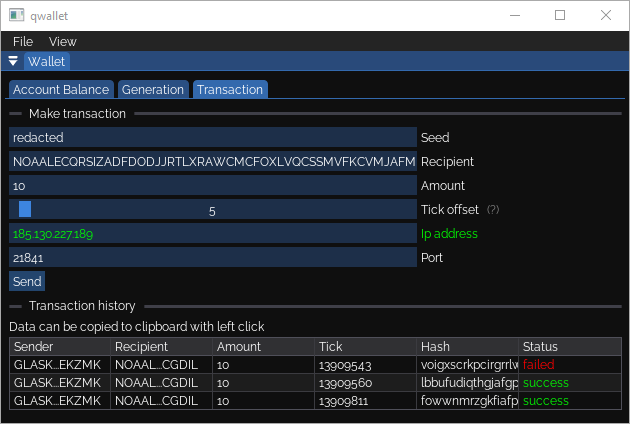

# qwallet

Qubic desktop wallet (Windows/Linux)

### License

All code is licensed under the anti-military [license](LICENSE.md) as provided by [Qubic](https://github.com/qubic/license).

### Preview

### Downloads

The binaries for both Windows and Linux can be downloaded from [releases](https://github.com/wilricknl/qwallet/releases).

### Description

The aim is to be a simple wallet with minimal dependencies. As this is a very early version of the wallet it requires a lot of manual configuration. The advantage is that it gives the possibility to directly pick a node to communicate with.

#### Features

* Requesting account balance
* Making transactions
* Generating new wallets (with a specific prefix)

#### Long term vision

* Improve user-friendliness through the following steps:
	* Provide a mechanism to automatically connect to computors
	* Overhaul the user interface
* Look into supporting Smart Contracts and Qx
* Add inspection tooling for spectrum and universe files

### Building

The build instructions for both Windows and Linux can be found in [BUILD](BUILD.md).

### Donation

If you want to support the development of this wallet you can send qus to the following address:

> WILRICKIONLLKATNHYCQQHXVXYDBNIQHXRMXJQUGFHVJTOIBUGKFFKLFNOLI
